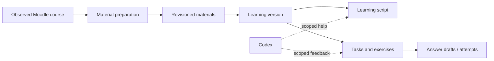

# First course learning flow (#12, #13, #14, #15)

This page records the original learning API foundation. The [reviewed workflow extension](reviewed-pipeline.md) now adds mandatory source-use review for new app-generated courses, inert MDX editing, task reconciliation, separate submissions/feedback and opt-in MCP writes. Full agent editing (#16), nested learning (#1), incremental content rebase and Drive backups (#9) remain broader follow-ups.

> This page documents the existing learning API. The [accepted content-pipeline design](content-pipeline.md) defines the next-stage source review, MDX authoring, task reconciliation, and feedback workflow; those capabilities are not implied by this contract. See also the implemented [optional text provenance](source-comparison.md) extension.




The persisted learning version is the ownership boundary between prepared source material and learner-facing script/tasks. Generation or agent assistance does not replace the revision and draft history described by this contract.

## Learning API (root ownership)

`GET /api/learning/courses/{courseId}` returns:
```
{courseId, activeVersionId: string|null, versions: [{id,createdAt,snapshotId,title,partial,sectionCount,exerciseCount}],
 activeVersion: LearningVersion|null, job: LearningJob|null,
 drafts: {[exerciseId]:string}, readingSectionId:string|null, messages:ChatMessage[]}
```
LearningVersion = `{id,createdAt,snapshotId,title,partial,warnings:string[],sections:LearningSection[],exercises:LearningExercise[],sources:LearningSource[]}`.
LearningSection = `{id,title,markdown,sources:SourceRef[],provenance?,format?,unitId?}`. `format` is `markdown` for legacy sections or `mdx` for the restricted learning profile. Other optional version/task fields are defined in the [reviewed workflow](reviewed-pipeline.md).
LearningExercise = `{id,title,prompt,hint,solution,origin:"generated"|"source",sources:SourceRef[]}`.
SourceRef = `{materialId,revision,blockId,page:number|null}`; all references validated against imported document blocks, never arbitrary model URLs.
LearningSource = `{materialId,revision,name}`.
LearningJob = `{id,status:"queued"|"running"|"completed"|"failed"|"cancelled",stage,completedSteps,totalSteps,error:string|null,candidateVersionId:string|null}`.
ChatMessage = `{id,role:"user"|"assistant",content,status:"completed"|"interrupted"}`.

- `POST /api/learning/courses/{courseId}/generate` `{snapshotId,allowPartial:boolean,consentToCodex:true}` returns state (202). The UI states that extracted course text and supported source images are sent to OpenAI through the connected Codex account. Require explicit action after showing coverage; do not auto-start on import/login. Only approved snapshot material is sent, no credential/auth context. No readable material = reject. Incomplete snapshot requires allowPartial true and visible partial label. One job per course, one Codex generation at a time.
- `POST /api/learning/courses/{courseId}/cancel` `{jobId}` returns state. Cancellation preserves all completed chunks and existing versions.
- `GET /api/learning/courses/{courseId}/versions/{versionId}` returns a version.
- `POST /api/learning/courses/{courseId}/activate` `{versionId}` selects a validated immutable version. Legacy first versions could become active automatically. Reviewed generations always produce a candidate for explicit activation. Previous versions and answer drafts persist.
- `PUT /api/learning/courses/{courseId}/drafts/{exerciseId}` `{answer}` returns state. Drafts max 12000 characters, retained across version switches and reload.
- `PUT /api/learning/courses/{courseId}/position` `{sectionId}` returns state.
- `POST /api/learning/courses/{courseId}/chat` `{versionId,message,consentToCodex:true}` returns text/event-stream: `event: delta` + `data: {text}`, final `event: completed` + `{message:ChatMessage}`, failure `event: error` + `{message}`. Input max4000 characters; one stream per course, cancel by aborting request. Persist user message and final/interrupted response; reload GET recovers conversation. Chat answers questions but does not edit script/exercises in this milestone. Context limited to selected version and its validated source references; no tools/host access.

All state is stored under STUDY_DATA_DIR/learning using atomic manifests and immutable versions, separate from protected Codex credentials. Generation uses bounded document chunks with page-aligned source images (at most eight images and 8 MiB decoded bytes per call), persists each validated chunk, resumes after restart, and never silently truncates source inputs. Model-provided Markdown renders without raw HTML, remote images or arbitrary navigation; citations are app-resolved only. A failed or partial result cannot masquerade as full course coverage.

## Material preparation API

- `GET /api/materials/courses/{courseId}`: `{courseId,snapshotId,status,coverage:{total,ready,failed,unsupported,pending,complete},materials,job,updatedAt}`. Material entries contain stable `id`, immutable `revision`, name/kind/MIME, section/module identity, status/reason, document/original paths and warnings. A changed provider resource revision does not change the stable material identity. No access-key URLs are returned.
- `POST /api/materials/courses/{courseId}/import` enqueues local work (202). `POST /api/materials/courses/{courseId}/reextract-pdfs` explicitly rebuilds PDF extraction into new immutable revisions even when the source bytes are unchanged. The normal revision identity includes the pinned PDF extraction profile, so an engine/profile upgrade invalidates only affected cached PDF extracts. `DELETE /api/materials/courses/{courseId}/jobs/{jobId}` cancels either job. Files and successful prior results survive cancellation/disconnect.
- `GET /api/materials/{materialId}/revisions/{revision}` returns structured blocks, asset references, actual engine/version/hash provenance, warnings and complete status. Blocks retain page/slide/order and available coordinates/table cells. Imported source revisions stay readable without Moodle.
- `GET /api/materials/{materialId}/revisions/{revision}/assets/{assetId}` resolves immutable local bytes only. PDF/raster bytes use the local viewer; other formats use forced attachment with a restrictive sandbox policy.

The durable coordinator has bounded attempts and process deadlines. Native PDF extraction uses pinned `pdf-inspector` 1.20.0 for classification, structured Markdown and positioned text/image items. Poppler renders immutable page images for visual review; Tesseract runs only for pages routed to OCR or lacking reliable native text, and records the language-model hashes. Office diagrams or linked references that cannot be read are reported explicitly. API, CLI and UI use this same state; metadata-only inventory is not labelled successful extraction.

## Codex API and runtime

`GET /api/codex` returns `{status,accountLabel,login,message}`. `POST /api/codex/login` starts device sign-in and returns `{id,userCode,verificationUrl,expiresAt,status}`; `GET /api/codex/login/{id}` reads progress; `DELETE` cancels the current request. `DELETE /api/codex` logs out only the separate Study Space profile. No host account credentials are imported.

The pinned Codex 0.153.1 app-server uses the supported ChatGPT device-code flow. The user completes sign-in at the allowlisted OpenAI page. Account tokens never reach the browser, normal data storage, prompts or logs. The API communicates with a separate private bridge using a token read from a protected file. The bridge has no published port or database-network attachment and mounts only its own credential directory plus that bridge token.

Generation uses ephemeral threads with `environments: []` on both thread and turn creation, no dynamic tools and disabled local/browser/MCP capabilities. Unexpected server tool/approval requests terminate the process. The process receives a clean environment and stops after every turn; authentication remains in the private profile. A missing/expired login or unavailable model fails without fabricating a response. Actual user sign-in and a real model response remain release acceptance checks in addition to synthetic protocol tests.

The model sees short integer citation labels instead of repeated material/revision hashes. The server resolves each label against its pinned source chunk and rejects non-integer, zero, negative or unknown labels; saved/public citations retain their full immutable material, revision, block and page references. Chunk cache identities include this prompt profile. Response array bounds match the existing validated section/exercise limits.

Version generation validates every block citation, saves each completed chapter and then creates a course-wide ordering that must include every prepared chapter exactly once. Retry uses a new attempt ID with the same immutable chunk cache; a cancelled old attempt cannot cancel its replacement. HTML and model-supplied navigation never become active browser content.

Read responses and chat context apply a presentation projection over the pinned local sources: contiguous multi-block exercise quotations are labelled as source exercises, and known broken direction glyphs between opposite 5-prime and 3-prime endpoints display as arrows. Saved version bytes, exercise IDs, source references and user answer drafts remain unchanged. If a pinned source is unavailable, its exercise is not asserted to be a verified source quotation. New output rejects unknown control characters.

The reader supports both dollar and standard TeX math delimiters outside literal code, retaining the same restrictions on HTML, links and media. Large chapter indexes start collapsed, support title/number search and close after selecting a chapter.
